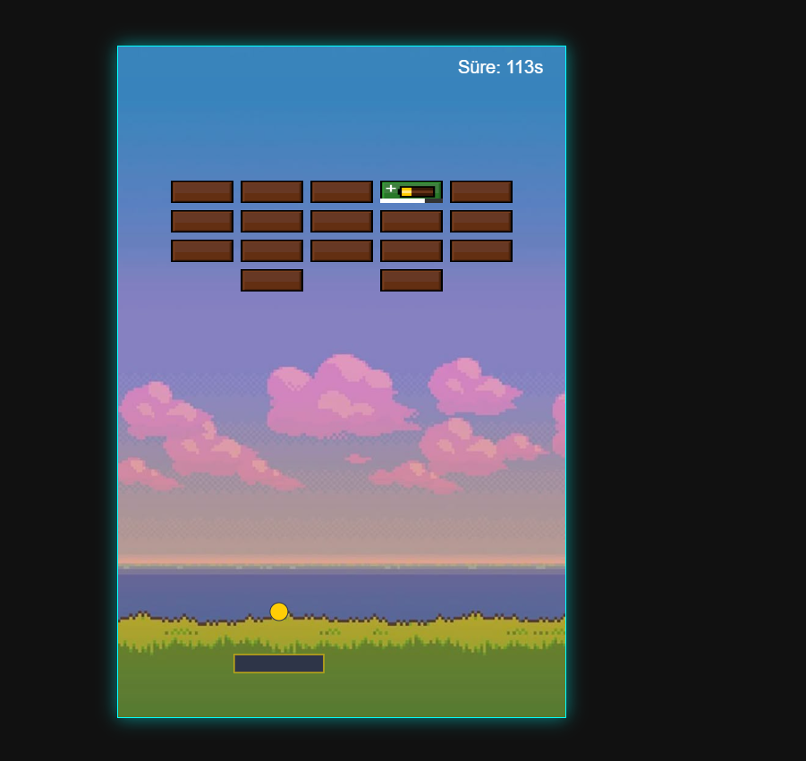
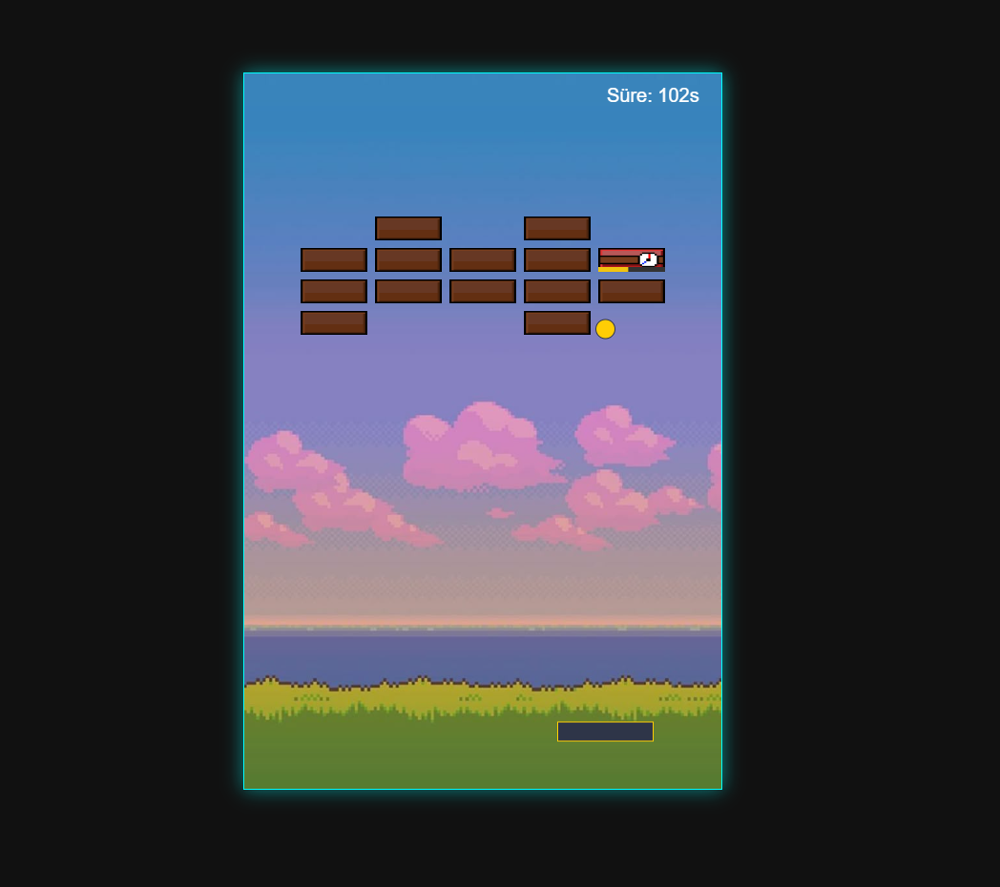

# BrickKeeperProject

https://ibrahimutkuveli.github.io/BrickKeeperProject

Oyunun amacı:120 saniye içerisinde olabildiğince fazla bloğu korumak. Bu bloklara otomatik şekilde bir top çarpıyor ver kırıyor bu blokları tıklayarak 2 saniye koruyabiliyoruz ve çeşitli blok türleri var rastgele ortaya çıkıyorlar.

Orijinal oyun linki:https://jimmy-t.itch.io/brick-keeper

ASSET Ve SESLER

Top sekmesi:https://pixabay.com/sound-effects/film-special-effects-button-124476/

Müzik: https://pixabay.com/music/upbeat-light-it-up-光を灯せ-268239/

Arkaplan: https://tr.pinterest.com/pin/754071531385299498/

Normal blok: https://img.itch.zone/aW1nLzEyNzMzMTA3LnBuZw==/original/o07eR7.png

Kalkanlı: https://img.itch.zone/aW1nLzEyNzMzMTE3LnBuZw==/original/cUzEKN.png

Bomba: https://img.itch.zone/aW1nLzEyNzMzMTY1LnBuZw==/original/6E%2Big7.png

Tamir: https://img.itch.zone/aW1nLzEyNzMzMjEwLnBuZw==/original/jSYsRH.png

Mavi blok: Gemini ile oluşturuldu

### Oyun İçi Ekran Görüntüleri

